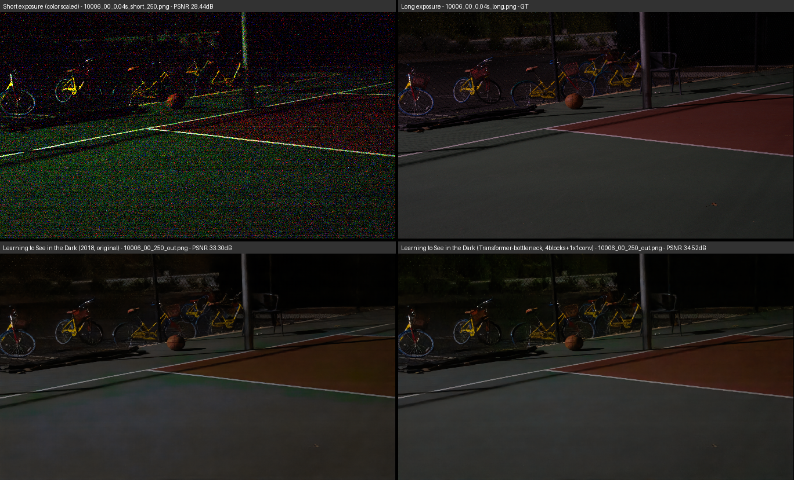
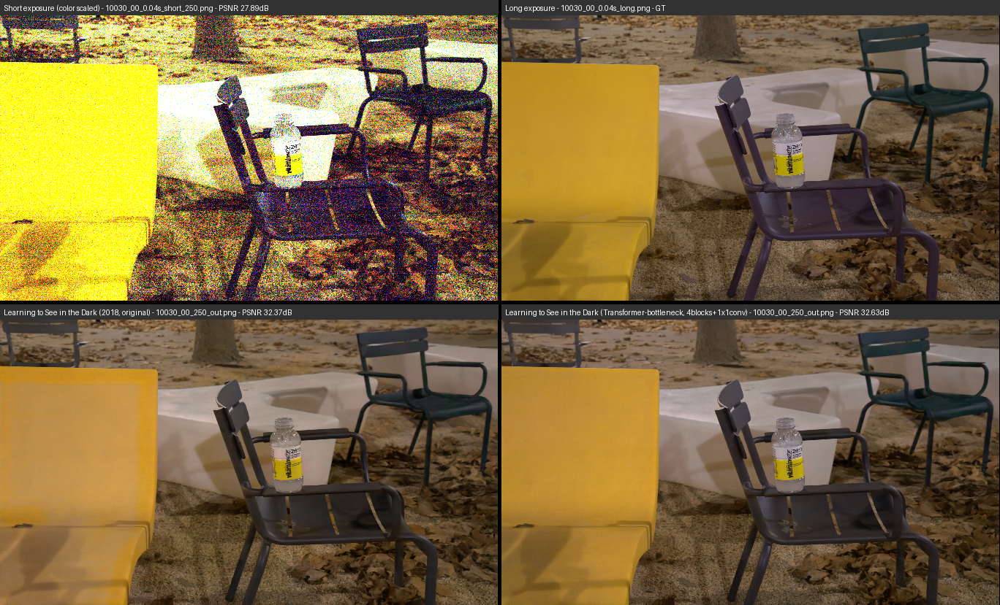
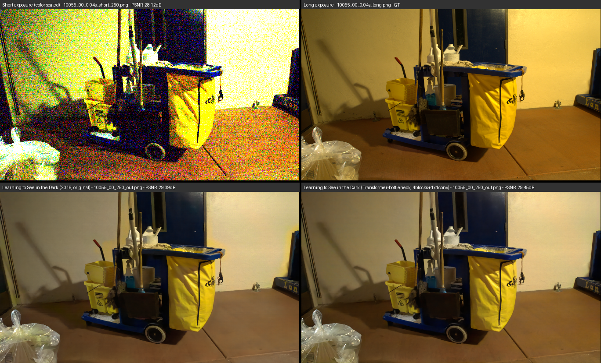

# SeeInDarkTransformer

SeeInDarkTransformer is a Transformer-based adaptation of "Learning to See in the Dark" in CVPR 2018, by Chen Chen, Qifeng Chen, Jia Xu, and Vladlen Koltun.
[Paper](https://arxiv.org/abs/1805.01934)
[Github Implementation](https://github.com/cchen156/Learning-to-See-in-the-Dark)

## Project Overview

The goal is to explore the capabilities of self-attention in capturing spatial dependencies for reconstructing high-quality images.  
Several CNN-Transformer-hybrid models are implemented in pytorch.
The models reuse some CNN-layers and weights from "Learning to See in the Dark" and are retrained to adapt to new Transformer elements using the same dataset. 
 This project contains training and evaluation scripts with extensive configuration, as well as tools for benchmarking, side-by-side comparisons, preprocessing and visualization of the training process.

## Quantitative Comparison

| Feature | Original (CNN-based) | Transformer-adaptation (2B) | Transformer-adaptation (4B) |
|---------|----------------------|-----------------------------|-----------------------------|
| Architecture | Convolutional UNet (5 Encoder + 4 Decoder layers) | 4 Conv-Encoder layers, 2 Transformer-Encoder, 4 Conv-Decoder layers | 4 Conv-Encoder layers, 2 Transformer-Encoder, 4 Conv-Decoder layers |
| Receptive field | Encoder: 248px  (5.83%) Decoder: 296px (6.95%) | Whole image | Whole image |
| Parameters | 7760268 | 6324620 | 7969932 |
| Inference time (L4 GPU, single batch, averaged) | 0.131s | 0.132s | 0.137s |
| Inference VRAM (L4 GPU, single batch, averaged) | 2.44GB | 2.43GB | 2.44GB |
| PSNR (average) | 28.54 dB | 29.60 dB | 29.64 dB |
| SSIM (average) | 0.80 | 0.81 | 0.81 | 

## Qualititave Results





## Setup

- Download the dataset using `download_dataset_sony.sh` or from the dataset creator [here](https://github.com/cchen156/Learning-to-See-in-the-Dark).
- Install required libraries: `pip install -r requirements.txt`

## Training

```bash
python train_model.py --model 'sid_bottleneck_transformer_2b'
```

Check out [config.py](./config.py) and [train_model.py](./train_model.py) for more config options

## Evaluation 

```bash
python test_model.py --model 'sid_bottleneck_transformer_2b'
```

## References

Chen Chen et al., *Learning to See in the Dark* (2018).[https://arxiv.org/abs/1805.01934](https://arxiv.org/abs/1805.01934)
Dosovitskiy et al., *An Image is Worth 16x16 Words: Transformers for Image Recognition at Scale* (2021). [https://arxiv.org/abs/2010.11929](https://arxiv.org/abs/2010.11929)
